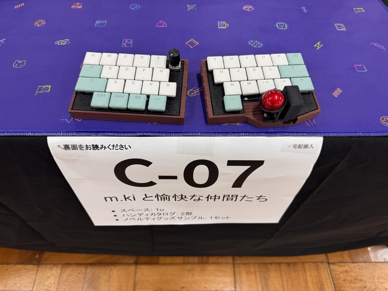

# cool936tb

## What is cool936tb?

cool936tb is small keyboard with trackball.
 
cool936tb is splite keyboards.
 
cool936tb use seeed xiao ble,run zmk_firmware.
 
 

## firmware

[zmk-config](https://github.com/telzo2000/zmk-config-cool936tb)

 
keymap editor

https://nickcoutsos.github.io/keymap-editor/

 
zmk studio

https://zmk.studio/

 

自作キーボードへのzmk_firmwareのインストールについて

https://sizu.me/m_ki/posts/kvixkn2mec6a

 
zmk_firmwareでのキーマップ編集について

https://sizu.me/m_ki/posts/m3devs7be5km

 

## buildguide

https://github.com/telzo2000/cool936tb/blob/main/buildguide_for_cool936tb.md

 

## BOM

<b>common parts</b>
| No. | Patrs | Quantity | remarks | Suppliers | Cost |
|--|--|--|--|--|--|
|番号|名前|数|備考|調達先|参考価格（送料込）| 
|1|PCB|3|Rightside,Leftside, Trackball|[elecrow](https://www.elecrow.com) [JLCPCB](https://jlcpcb.com) [ALLPCB](https://www.allpcb.com)|| 
|2|Switch plate|2|3D Print|||
|3|Bottom plate|2|3D Print|||
|4|Ball case|1|3D Print|||
|5|pinheader ピンヘッダ|1|7pin,L字形 コンスルーでも可|[秋月電子](https://akizukidenshi.com/catalog/g/g101627/) [モノタロウ](https://www.monotaro.com/p/4372/1914/?srsltid=AfmBOooNFXhsyVNPPtl8VZ9vMxbrLr2A5btmrf5l_N4rMR9fy4N_bydG) [マルツオンライン](https://www.marutsu.co.jp/pc/i/106993/)||
|6|Slide switch スライドスイッチ|2||[秋月電子](https://akizukidenshi.com/catalog/g/g115370/)|１個30円|
|7|AAAA Battery case 単４電池ケース|2||[マルツオンライン](https://www.marutsu.co.jp/pc/i/59151/?srsltid=AfmBOoo5ctOn9kOUGJA7pCL4M2f4Y3IolfSweL7epFytDI-BLKNBKMa8)|１個81円|
|8|XIAO nRF52840|2|MCU Board|[seeed studio](https://jp.seeedstudio.com/Seeed-XIAO-BLE-nRF52840-p-5201.html?msclkid=5541f7f3d0f911eca6023fe520de5bfa) [秋月電子](https://akizukidenshi.com/catalog/g/g117341/)|1940円|
|9|Trackball トラックボール|1|25mm級|[Amazon](https://www.amazon.co.jp/dp/B0D4DYH8XY?ref=ppx_yo2ov_dt_b_fed_asin_title)等|1300円ほど|
|10|PWM3610|1|Trackball senser|[アリエク](https://ja.aliexpress.com/item/1005007622547772.html?spm=a2g0o.order_list.order_list_main.45.72e8585aVqU7cH&gatewayAdapt=glo2jpn)|1000円ぐらい|
|11|Rotery Encoder ロータリーエンコーダー|1|EC12互換|||
|12|Knob ロータリーエンコーダー用ノブ|1|直径19mm以下のもの|||

 

<b>If you use choc switch...</b>
| No. | Patrs | Quantity | remarks | Suppliers | Cost |
|--|--|--|--|--|--|
|13|Diode ダイオード|37|SMD|[遊舎工房](https://yushakobo.jp) [Talp Keyboard](https://talpkeyboard.net) [Daily Craft Keyboard](https://shop.dailycraft.jp)等|100個で220円程度から|
|14|Swith socket スイッチソケット|36|choc|[遊舎工房](https://yushakobo.jp) [Talp Keyboard](https://talpkeyboard.net) [Daily Craft Keyboard](https://shop.dailycraft.jp)等|10個で165円程度|
|15|Screw ネジ|8|スリムヘッドM2 5mm|[遊舎工房](https://shop.yushakobo.jp/products/a0800s2?variant=37665432535201)|50本880円(遊舎工房)|
|16|Screw ネジ|12|M2 4mm|DIY shop|10本200円程度|
|17|Spacer スペーサー|2|M2 3mm|DIY shop|10本400円程度|
|18|Spacer スペーサー|8|M2 6mm|DIY shop|10本400円程度|
|19|Keyswitch キースイッチ|36|chocV1及びV2対応|[遊舎工房](https://yushakobo.jp) [Talp Keyboard](https://talpkeyboard.net) [Daily Craft Keyboard](https://shop.dailycraft.jp)|１個100程度|
|20|Keycap キーキャップ|36|ロープロが最適|[遊舎工房](https://yushakobo.jp) [Talp Keyboard](https://talpkeyboard.net) [Daily Craft Keyboard](https://shop.dailycraft.jp)||
|21|リセットスイッチ（タクトスイッチ）|2||[秋月電子](https://akizukidenshi.com/catalog/g/g108073/)|１個20円|

 

<b>If you use cherryMX switch...</b>
| No. | Patrs | Quantity | remarks | Suppliers | Cost |
|--|--|--|--|--|--|
|13|Diode ダイオード|37|SMDまたはリードタイプ|[遊舎工房](https://yushakobo.jp) [Talp Keyboard](https://talpkeyboard.net) [Daily Craft Keyboard](https://shop.dailycraft.jp)等|100個で220円程度から|
|14|Swith socket スイッチソケット|36|cherry MX|[遊舎工房](https://yushakobo.jp) [Talp Keyboard](https://talpkeyboard.net) [Daily Craft Keyboard](https://shop.dailycraft.jp)等|10個で165円程度|
|15|Screw ネジ|8|M2 8mm|DIY shop|10本200円程度|
|16|Screw ネジ|12|M2 4mm|DIY shop|10本200円程度|
|17|Spacer スペーサー|10|M2 3mm|DIY shop|10本400円程度|
|17|Spacer スペーサー|4|M2 6mm|DIY shop|10本400円程度|
|18|Keyswitch キースイッチ|36|cherry MX|[遊舎工房](https://yushakobo.jp) [Talp Keyboard](https://talpkeyboard.net) [Daily Craft Keyboard](https://shop.dailycraft.jp)|１個100程度|
|19|Keycap キーキャップ|36|cherry MX互換|[遊舎工房](https://yushakobo.jp) [Talp Keyboard](https://talpkeyboard.net) [Daily Craft Keyboard](https://shop.dailycraft.jp)||
|20|リセットスイッチ（タクトスイッチ）|2||[秋月電子](https://akizukidenshi.com/catalog/g/g108073/)|１個20円|
 

 

In addition, NiHM rechargeable batteries (4 AAA size), USB cable, etc. are required.
 
この他に、NiHM充電池（単４形４本）、USBケーブル等が必要です。
 

 

# license

[CC BY-NC-SA](https://creativecommons.org/licenses/by-nc-sa/4.0/deed.ja)

